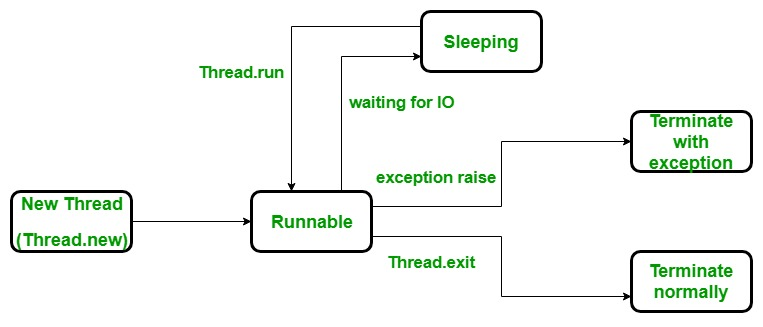

## Lifecycle of a Thread in Python

### What is a Thread?

- A **thread** is a flow of execution in a program.
- Every Python program has at least **one thread**, called the **main thread**.
- Both **processes and threads** are created and managed by the **operating system**.

---

### Why Do We Use Threads?

- Sometimes we need to run multiple tasks at the same time (**concurrently**)
- For that, we create additional threads using the `threading` module

⚠️ But:
- Multiple threads accessing shared data can lead to **race conditions**
- This can cause **unpredictable or incorrect output**

---

## Thread Lifecycle

---

---

Every thread goes through the same lifecycle:

### 1. New (Created)
- Thread object is created
- But it has **not started execution yet**

---

### 2. Runnable (Ready)
- After calling `start()`
- Thread is ready to run and waiting for CPU

---

### 3. Running
- Thread is actively executing its task

---

### 4. Blocked / Waiting / Sleep
- Thread is waiting due to:
  - `sleep()`
  - `join()`
  - waiting for a lock or resource

---

### 5. Terminated (Dead)
- Thread has finished execution
- Cannot be restarted again

---

## Common Interview Questions

---

### Q1. Difference between Creating and Starting a Thread?

| Creating Thread | Starting Thread |
|----------------|----------------|
| Thread object is created | Thread execution begins |
| No execution happens | Calls `run()` internally |
| Just preparation | Actual work starts |

---

### Q2. Difference between `run()` and `start()`?

| `run()` | `start()` |
|--------|----------|
| Normal method call | Starts a new thread |
| Runs in main thread | Runs in separate thread |
| No concurrency | Enables multithreading |

👉 Always use `start()` to run threads properly

---

### Q3. Difference between Blocked and Terminated?

| Blocked | Terminated |
|---------|------------|
| Thread is waiting | Thread has finished |
| Can resume later | Cannot restart |
| Temporary state | Final state |

---

## Simple Understanding

- **Create → Start → Run → Wait (if needed) → Finish**

---

## Key Takeaway

- Every thread follows a fixed lifecycle
- Understanding states helps in debugging and writing correct concurrent programs
- Improper handling can lead to issues like **race conditions**